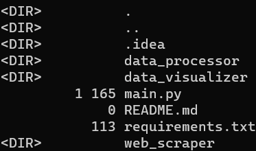
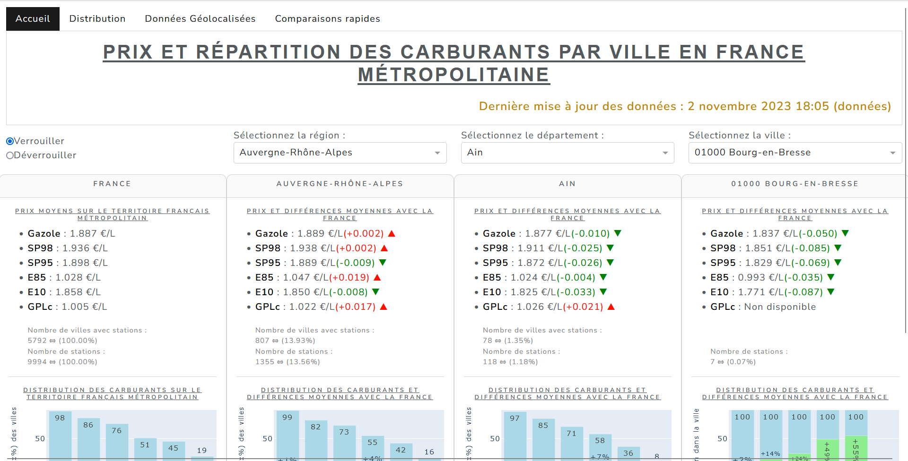
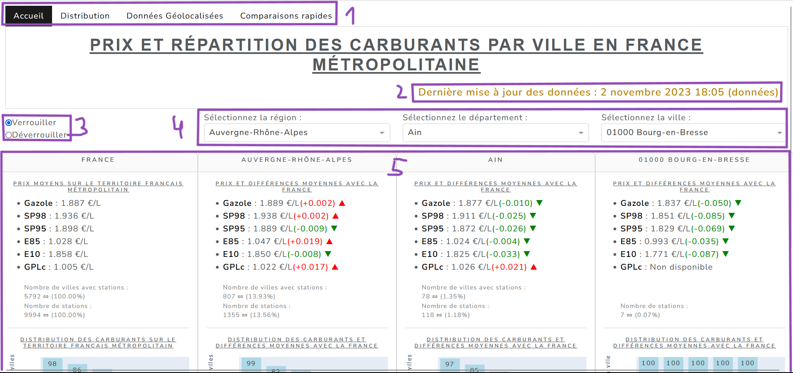
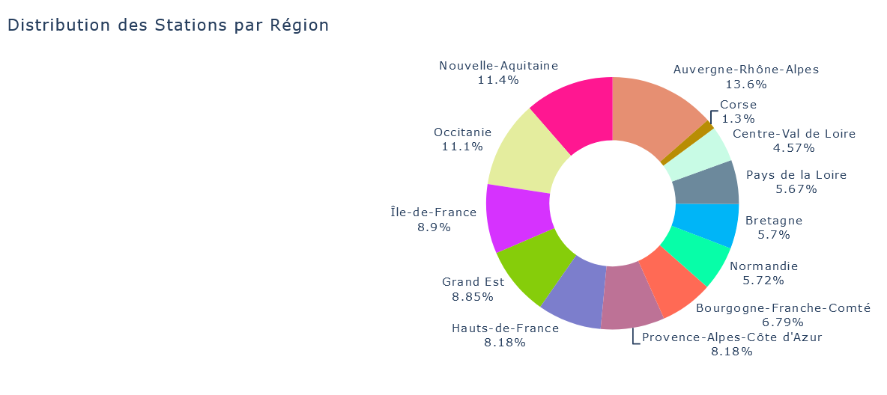
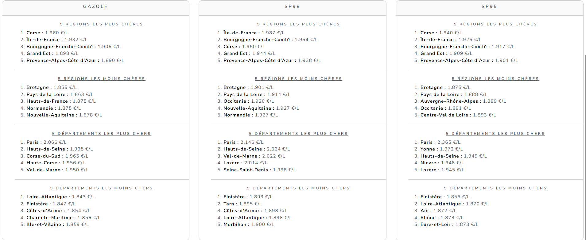
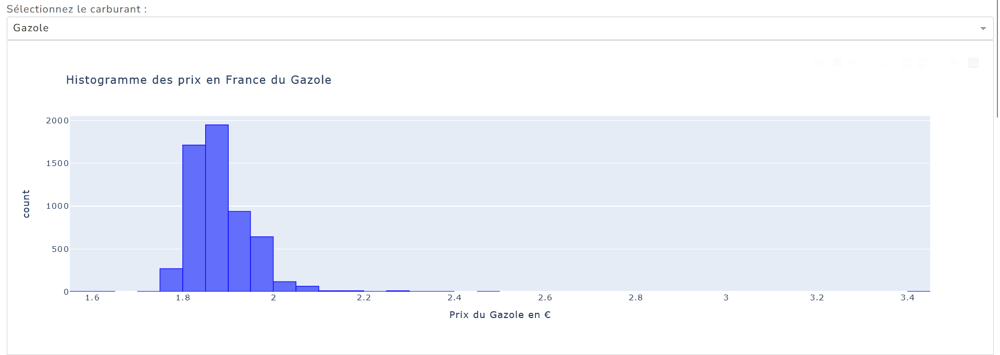
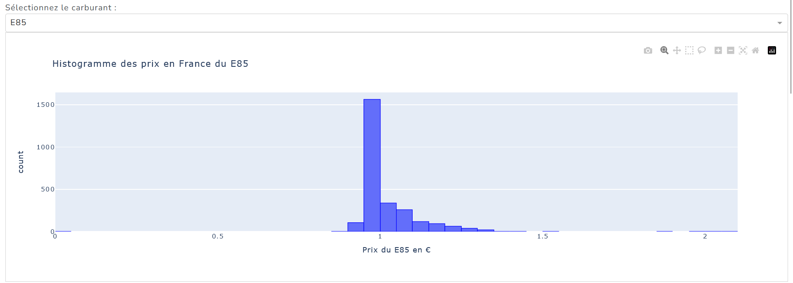
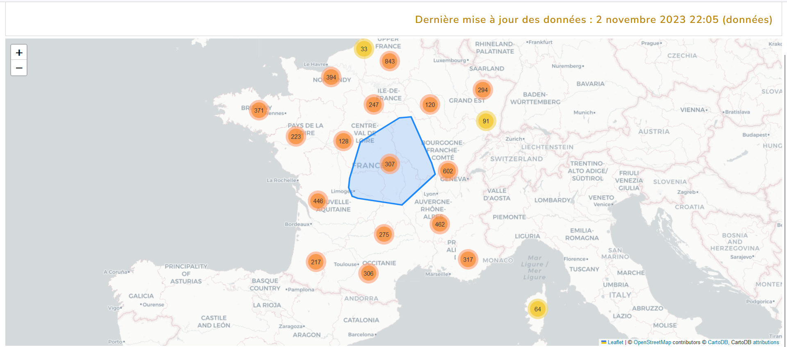
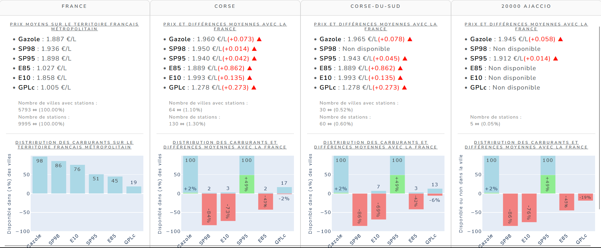
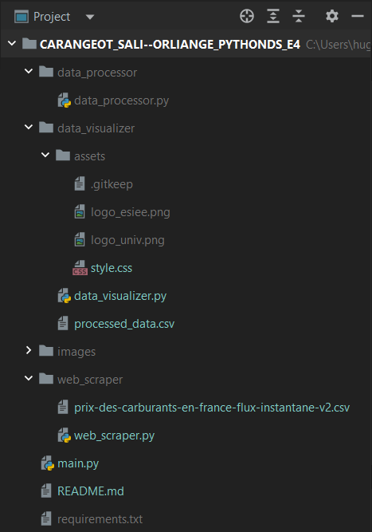

## THIS README IS IN FRENCH, PLEASE USE TRANSLATER IF NEEDED

# Tables des matières

## Guide de l’utilisateur
1. [De Git au répertoire local](#1---de-git-au-répertoire-local)
2. [Lancer le programme python et accéder au Dashboard](#2---lancer-le-programme-python-et-accéder-au-dashboard)
3. [Utiliser le Dashboard](#3---utiliser-le-dashboard)

## Rapport d’analyse
1. [Rappels](#1---rappels)
2. [Analyse des données de stations service en France](#2---analyse-des-données-de-stations-service-en-france)

## Guide du développeur
1. [Contexte](#1---contexte)
2. [Structure logique](#2---structure-logique)
3. [Continuer le développement](#3---continuer-le-développement)

# GUIDE DE L’UTILISATEUR

## 1 - De Git au répertoire local

Dans cette partie, nous allons nous intéresser sur comment récupérer le projet 
disponible sur Git dans le but de l’avoir sur la machine locale.

### Prérequis

- Ce projet est codé en python, c'est pourquoi il est nécessaire d’installer 
ce langage de programmation (ou le mettre à jour si nécessaire).

[Installer une version de python au moins égale à 3.11](https://www.python.org/downloads/)

- Par ailleurs, il faut avoir Git pour cloner le projet

[Télécharger Git](https://git-scm.com/download/win)

### Exportation du projet et téléchargement des modules nécessaires

Une fois que vous disposez de ces prérequis, nous allons pouvoir exporter le 
projet sur votre répertoire local :

Cela se déroule en deux étapes :

1. Cloner le répertoire sur sa machine :

   Pour ce faire, ouvrez le ‘Git Bash’ (vous pouvez le chercher depuis la barre
   de recherche windows). Rentrez la commande suivante dans ‘Git Bash’ :

   *git clone https://git.esiee.fr/carangeh/carangeot_sali-orliange_pythonds_e4*
     

2. Installer les packages nécessaires au programme :

   Pour ce faire, ouvrez l' ’Invite de Commandes’ (vous pouvez la chercher 
   depuis la barre de recherche windows). À l’aide de la commande ‘cd’ rejoignez
   votre dossier ‘CARANGEOT_SALI-ORLIANGE_PYTHONDS_E4’ qui correspond au dossier
   cloné de Git.  

   Si vous rentrez la commande ‘dir’(windows, ‘ls’ pour unix) une fois dans 
   le dossier, vous devriez voir ceci :  

   

   ⚠Si ce n’est pas le cas, assurez-vous de bien vous 
rendre dans ce dossier avant de continuer⚠   

   Enfin, depuis ce dossier, rentrez la commande suivante :  

   *python -m pip install -r requirements.txt*

## 2 - Lancer le programme python et accéder au Dashboard

Veuillez bien attendre la fin de tous les téléchargements dans votre 
‘Invite de Commandes’.
Toujours dans ce terminal, entrez la commande suivante, cela permettra de lancer
le code en charge du bon fonctionnement de l’application : 

*python main.py*

Après quelques instants (soyez patient), vous devriez avoir ceci dans votre 
terminal : 

S’il n’y a aucun problème, ouvrez http://127.0.0.1:8050/ dans un navigateur web 
(firefox, chrome…) sans fermer votre ‘Invite de Commandes’ (le main.py a besoin 
de tourner pour mettre à jour les données sur votre dashboard).

## 3 - Utiliser le Dashboard

Lorsque vous ouvrez cet url, vous devriez obtenir ceci :

Voici quelques brèves annotations sur l’utilisation du site :

1. C’est la barre de navigation, dans le cadre en noir, c’est la page courante,
à côté les autres pages disponibles. 
2. La dernière date de mise à jour des données récupérées sur le [site du 
gouvernement français](https://data.economie.gouv.fr/explore/dataset/prix-des-carburants-en-france-flux-instantane-v2/table/) 
lorsque vous avez tapé la commande python main.py 
3. Deux modes sont disponibles pour la partie 4, ‘Verrouiller’ et 
   ‘Déverrouiller’. 
   - Dans le premier, seuls les départements de la région sélectionnée seront 
      disponibles et seules les villes du département sélectionné seront 
      disponibles.
   - Dans le second, vous pouvez accéder à TOUS les départements et TOUTES les 
     villes de France, peu importe la région sélectionnée.
4. Les différents menus déroulants permettant de choisir les différentes 
  visualisations de la partie 5.
5. Zone des différentes visualisations des données.

Pour les autres pages, la logique d’utilisation demeure la même ! 

⚠La page ‘Données Géolocalisées’ prend un petit peu 
de temps à charger, patientez le temps que cela s’ouvre, une fois chargée, elle
sera totalement fluide⚠ 

Bonne exploration ٩(^ᴗ^)۶

# RAPPORT D’ANALYSE

## 1 - Rappels

De plus, rappelons que notre objectif est d’avoir un aperçu rapide des derniers 
prix disponibles pour chaque carburant sur le territoire français, ainsi que de
montrer leurs répartitions. On a décidé de regrouper nos stations par ville 
(ex Champs-sur-Marne, 1 station…) et de faire le prix moyen de chaque carburant 
par ville. De cette manière, nous sommes capables de dire quelles villes 
disposent d’au moins une station et quels sont les prix pour cette zone 
géographique.

Notre analyse est faite au 2 novembre 2023, les données étant récupérées 
dynamiquement et le carburant ayant des prix très volatils et incertains ces 
derniers temps peuvent ne plus correspondre à notre analyse. De même, à cette 
date, les carburants disponibles sur le territoire français sont : Gazole, SP98,
SP95, E85, E10, GPLc.

⚠Nos réponses sont appuyées par quelques images, elles
ne sont cependant pas exhaustives, cela permet juste d’illustrer quelques 
propos, il faut naviguer sur le site pour tout voir.⚠

## 2 - Analyse des données de stations service en France

L'objectif principal était de créer un dashboard pour visualiser ces 
informations. Voici les principales conclusions tirées de l'analyse des 
données :

### Population et Répartition des Stations

Comme indiqué dans les piecharts, il est clair que les [régions les plus 
peuplées](https://fr.statista.com/statistiques/499848/nombre-habitants-par-region-france/)
correspondent à celles qui ont le plus grand nombre de stations-service. Cela 
est conforme à l'attente, sauf pour l'Île-de-France, qui bien qu'étant la plus 
peuplée, se classe seulement quatrième en termes de nombre de stations.

### Prix des Carburants

Les régions de Corse et d'Île-de-France, ainsi que leurs départements 
respectifs, affichent les prix les plus élevés pour les carburants. En revanche,
les régions les moins chères ne sont pas toujours les mêmes, bien que la 
Bretagne et les Pays de la Loire, et plus particulièrement le Finistère, 
soient en tête du classement des moins chers. Pour la Bretagne, on pourrait 
expliquer cela par l’hyper-concurrence sur le territoire. Pour les autres 
départements à bas prix, il semble y avoir plus de variabilité.

### Distribution des Carburants

- Le Gazole, le SP98, le SP95 et le GPL présentent une distribution semblable à 
une loi normale. Cela se traduit par des variations de prix marquées, 
indiquant une grande sensibilité à certains facteurs.
- Les E10 et E85 quant à eux présentent une distribution avec une 
  concentration de prix autour d'une valeur médiane, indiquant une relative 
  stabilité des prix sur le territoire national.
- Les carburants sans plomb (SP98 et SP95) montrent des prix relativement 
  proches, avec un léger supplément pour le SP98.

### Accessibilité aux Stations

La carte révèle que la diagonale du vide compte très peu de stations-service, 
ce qui signifie qu'elles sont éloignées de nombreuses villes. L'accès à ces 
ressources est donc plus compliqué dans ces régions. Sans surprise, les régions 
plus peuplées ont tendance à avoir un accès bien plus simple aux stations, 
notamment pour l’IDF, championne en la matière avec par exemple plus de 50 
stations rien que pour Paris intra-muros. 

### Desserte en Carburants par Région

Les régions les mieux desservies en carburant se situent principalement 
dans le sud de la France.  
Une exception notable est la Corse, qui dispose de très peu d'options de 
carburant, se limitant essentiellement au gazole et au SP95.  
L'Île-de-France est également très bien pourvue en stations-service.

# GUIDE DU DÉVELOPPEUR

## 1 - CONTEXTE

Dans un premier temps, il est important de notifier que pour que les codes 
soient compréhensibles par un maximum de personnes, nous avons codé en anglais.

Nous respectons au maximum les conventions 
[pep-8](https://peps.python.org/pep-0008/)

Nous ne nous attarderons pas à la compréhension totale des codes, nous 
expliquerons juste nos choix, nos raisons et la structure logique qui encadre 
tout ça.

De plus, rappelons que notre objectif est d’avoir un aperçu rapide des derniers 
prix disponibles pour chaque carburant sur le territoire français, ainsi que de
montrer leurs répartitions. On ne s’intéressera pas à la qualité du service 
rendu par les stations (ex 24/24h, 1 pour x habitants…). On a également 
décidé de regrouper nos stations par ville (ex Champs-sur-Marne, 1 station…) et 
de faire le prix moyen de chaque carburant par ville. De cette manière, nous 
sommes capables de dire quelles villes disposent d’au moins une station et quels
sont les prix pour cette zone géographique.

## 2 - STRUCTURE LOGIQUE

Voici la structure complète du projet :

Nous avons décomposé le code en 4 fichiers python :

- Un fichier main.py qui appelle les 3 autres.
- Les 3 trois autres se trouvent dans les dossiers ‘data_processor’, 
  ‘data_visualizer’, ‘web_scraper’ et se nomment respectivement 
  ‘data_processor.py’, ‘data_visualizer.py’, ‘web_scraper.py’. 

Comprenons pourquoi cette structuration à travers notre main.py :

Il est important de savoir qu’une grande règle lorsque l’on code, c'est 
‘compartimenter’. En effet, on cherche à tout prix à fuir un [code 
spaghetti](https://www.google.com/search?client=firefox-b-d&q=code+spaghetti).
Il ne faut pas mélanger des parties qui n’ont pas de liens entre elles ! A 
priori, on peut télécharger un fichier sans vouloir faire un dashboard avec…
On a donc décomposé la totalité de nos lignes de commandes en 3 modules : 
- web_scraper : récupérer les données sur le site du gouvernement
- data_processor : traiter les données récupérées pour les rendre propres à 
  l’utilisation pour le dashboard
- data_visualizer : utiliser les données traitées pour créer un dashboard

De cette manière, si l’on disposait déjà des données, on n’aurait pas besoin 
de web_scraper mais ça n'impacterait pas le reste de nos codes…

On distingue clairement l’utilisation de nos 3 autres fichiers python après la 
déclaration de nos variables globales.
Ces 3 autres fichiers python, aussi appelés modules, comportent chacun une 
classe qui elle-même contient des fonctions. Nous avons décidé de créer des 
classes pour 2 grandes raisons :

- Lisibilité du code. On comprend plus facilement quels objets nous 
  manipulons et quelles actions y sont associées. Cela rend donc le code plus 
  simplement maintenable par la même occasion.
- Utilisation des instances dans le fichier main.py. Chaque objet dispose 
  d’attributs et cela permet de les utiliser dans d’autres segments de code, 
  par exemple, nous utilisons le nom du CSV pour le traiter et cette 
  information est contenue dans notre objet qui télécharge le CSV, logique 
  n’est-ce pas !

Néanmoins, la puissance des classes en python n’est pas vraiment utilisée dans
notre code, car nous ne faisons pas plusieurs instances… Ici, c'est plus dans 
l’intérêt d’une compréhension rapide et d’un rangement logique.

Voici un extrait de code du module ‘web_scraper.py’, de la classe 
FirefoxScraperHolder.

Cette fonction est chargée de récupérer la date de dernière mise à jour et le 
fichier CSV. Les textes en bleu sont des fonctions, on voit bien ici 
l’intérêt des fonctions. Par exemple, ‘click_on’ est parlant pour tout le 
monde, ça évite par ailleurs la duplication de code.

Pour rappel, les membres en python sont tous publics, pour signaler au 
programmeur que l’utilisation ne doit être qu’interne au module (membres 
protégés), nous précédons le nom de ce dernier par ‘_’ ou par ‘__’ pour 
signaler que c’est privé. De même, pour les getters et setters, nous utilisons 
les décorateurs @property.

La même logique concernant l’utilisation de classe et de fonctions est appliquée
dans les autres modules.

On ajoutera quand même que pour la visualisation des données (donc dans le 
dossier data_visualizer), nous avons ajouté un sous dossier ‘assets’, permettant
un rangement propre pour nos images et notre fichier css. 
Nous avons utilisé un fichier css pour réduire au maximum la duplication de code
dans ‘data_visualizer’ et surcharger ce module. De plus, si l’on veut modifier 
directement le style du dashboard, on pourra seulement se contenter de se 
balader dans le css (ce fichier est complémentaire à un bootstrap).

Nous sommes tout de même conscients que notre code n’est pas parfait.

Par exemple, notre dashboard contient 4 pages. Il aurait fallu faire un fichier 
python contenant les callback, méthodes, etc, associées à chaque page pour une 
meilleure lisibilité, compartimentation et logique plutôt que d’avoir toutes 
les pages dans notre seul fichier ‘data_visualizer.py’. Cependant, nous avons 
privilégié le fait d’expérimenter d’autres choses, comme avec l’ajout de style 
via le css car nous manquions de temps et l’on préférait apprendre de nouvelles 
choses.

## 3 - CONTINUER LE DÉVELOPPEMENT

Voici rapidement quelques idées d’ajouts, ou axes d’améliorations :

- Doctests : rédiger les doctests (on ne l'a pas fait par manque de temps).
- Carte : sélection d’une zone géographique, d’un carburant… 
- Dashboard : scinder l'app en plusieurs fichiers : une page = un fichier, 
avec ses propres callbacks…
- Comparaison de deux villes, régions…
- Montrer la station la moins chère dans une zone géographique (ex 
Champs-sur-Marne dans un cercle de 10 km pour une maj de moins de 3j… )

Bon code ٩(^ᴗ^)۶
